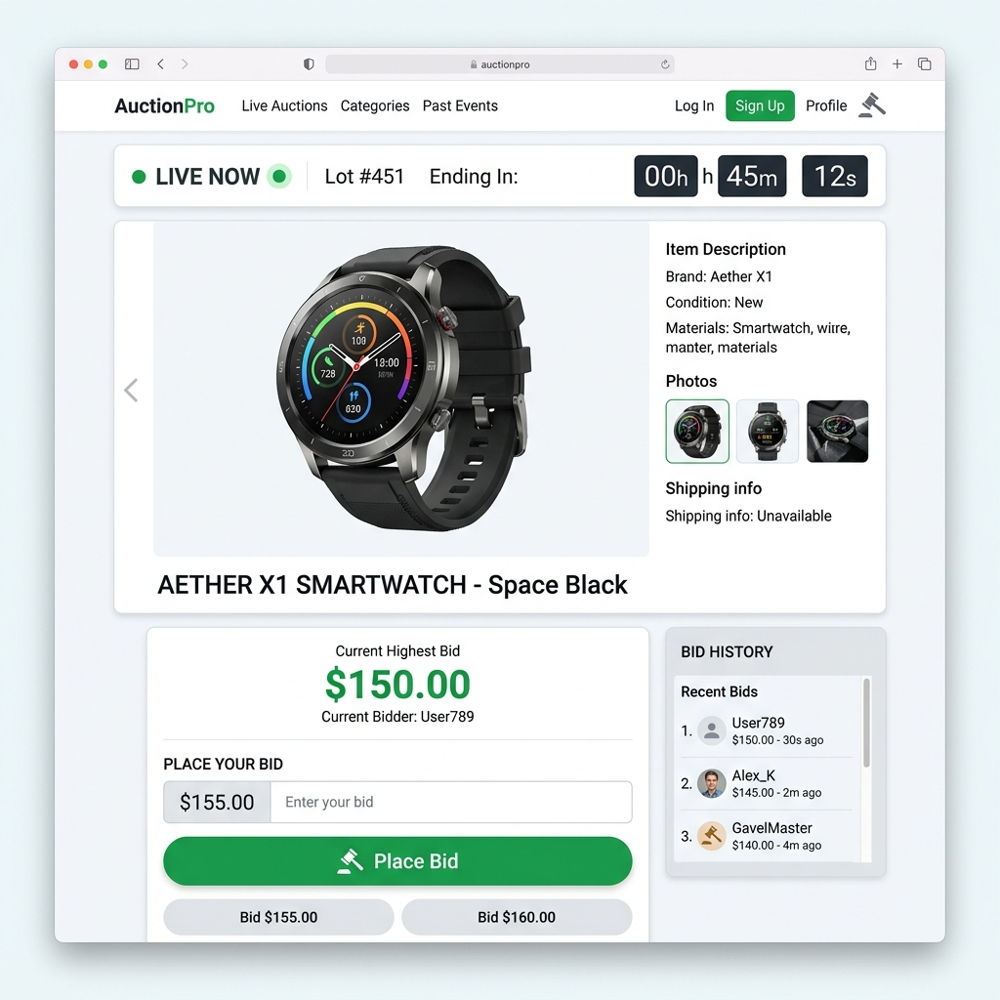
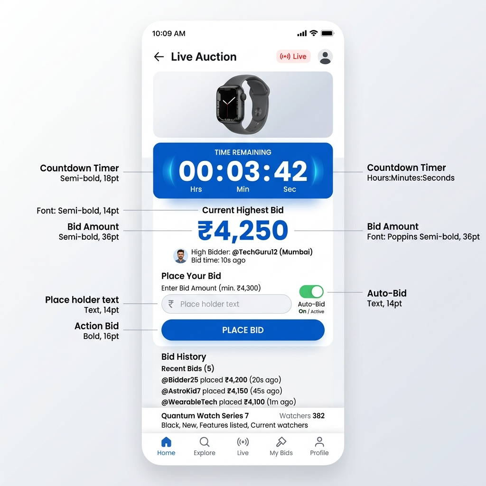

# 🔨 Distributed Auction System

A robust, real-time distributed auction platform built using **Jakarta EE**. This system leverages enterprise-grade Java technologies to provide a seamless bidding experience with advanced features like automated proxy bidding and live state synchronization.


---

## 📸 Application Interface

| Desktop View | Mobile View |
| :---: | :---: |
|  |  |

---

## 🌟 Key Features

- **⚡ Live Bidding Dashboard**: Real-time visualization of the highest bid, current leader, and auction countdown.
- **🤖 Intelligent Auto-Bidding**: Users can set a maximum bid, and the system will automatically place incremental bids on their behalf to maintain leadership.
- **📜 Dynamic Bid History**: A live-updating activity log showing all bidding events, including automated system bids.
- **⏱️ Precise Countdown**: Interactive timer that automatically disables bidding once the auction expires.
- **📱 Responsive Design**: Fully mobile-friendly interface built with Bootstrap 5.
- **🛡️ Enterprise Architecture**: Utilizes Singleton EJBs for state management and thread safety across distributed environments.

---

## 🛠️ Tech Stack

### Backend
- **Jakarta EE 10+**: Core enterprise platform.
- **EJB (Enterprise Java Beans)**: Used `@Singleton` and `@Lock` for centralized, thread-safe auction management.
- **JMS (Java Message Service)**: Infrastructure for distributed notifications.
- **CDI**: Context and Dependency Injection for modular component management.
- **Servlets & JSP**: Server-side request handling and dynamic content rendering.

### Frontend
- **Bootstrap 5**: Modern, responsive UI components.
- **JSTL**: JavaServer Pages Standard Tag Library for clean UI logic.
- **AJAX / Fetch API**: Asynchronous polling for real-time data updates without page reloads.

---

## 📂 Project Structure

```text
auction-system/
├── src/main/java/com/hasith/auction/
│   ├── beans/          # EJB Business Logic (AuctionManager, Notifications)
│   └── web/            # Servlets and Web Controllers
├── src/main/webapp/    # JSP Pages and Static Assets
├── pom.xml             # Maven Project Configuration
└── README.md           # Project Documentation
```

---

## 🚀 Getting Started

### Prerequisites
- **JDK 11** or higher
- **Maven 3.8+**
- **Jakarta EE Compatible Server** (e.g., Payara Server, WildFly, or Glassfish)


### Installation & Deployment

1. **Clone the repository:**
   ```bash
   git clone https://github.com/your-username/auction-system.git
   cd auction-system
   ```

2. **Build the project:**
   ```bash
   mvn clean package
   ```
   This will generate an `auction-ui.war` file in the `target/` directory.

3. **Deploy:**
   - Copy the `auction-ui.war` to your application server's `autodeploy` or `deployments` folder.
   - Start the server.

4. **Access the App:**
   Open your browser and navigate to `http://localhost:8080/auction-ui`.

---

## 🧠 Core Logic: The Auto-Bidder

The system implements a **Proxy Bidding** algorithm. When multiple users enable auto-bid:
1. The system calculates the minimum increment required to outbid the current highest.
2. It simulates a "bidding war" between auto-bid users until the second-highest maximum bid is reached.
3. The final bid is set to one increment above the second-highest max bid, or exactly the top user's max bid if necessary.

---

## 🤝 Contributing

Contributions are welcome! Feel free to open an issue or submit a pull request.

---

## 📄 License

This project is licensed under the MIT License - see the [LICENSE](LICENSE) file for details.

---
*Developed by [Hasith Disanayaka](https://github.com/HasithDisanayaka)*
